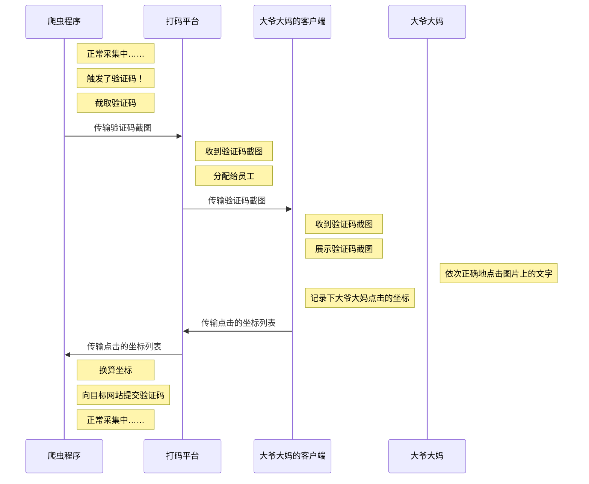

> 方案要点：
>
> - 点选式验证码的一般解决流程
>
> - 如何使用 [xyolo](https://github.com/AaronJny/xyolo) 训练自己的目标检测模型
> - 不借助 OCR 功能解决中文验证码的识别问题

爬虫，反爬虫，反反爬虫……一个无限循环。

验证码是反爬虫手段中的常用技术，今天，笔者选择其中的一种——`汉字点选式验证码` 和大家分享一下。

点选式验证码一般会给定两部分内容：

- 需要点击的几个汉字（为了便于区分，把这部分称为标签部分）。可能直接给文字（可以直接从html中知道是什么字），也可能给一张包含这几个字的图片（从html里面只能获得这张图片，并不知道图片里面是什么字）。
- 生成的验证码图片（为了便于区分，把这部分称为验证部分）。一般给一张背景图，里面包含多个（大于等于需要点击的汉字个数）被扭曲、加工过的汉字。

要求我们按照汉字给出的顺序，在生成的验证码图片中依次点击正确汉字。下面给个例子：


其中，上方的 `济拉` 是给定的、需要点击的文字；下方是被点击区域，包含六个被扭曲、加工过的汉字，我们需要依次正确点击 `济` 、 `拉` 两个字。

是不是感觉挺复杂的样子？莫怕，我们能搞定它！


此项目已经上传到GitHub，你可以直接从GitHub访问源代码和数据集：

[https://github.com/AaronJny/captcha_detection](https://github.com/AaronJny/captcha_detection)

转载请注明来源：[https://blog.csdn.net/aaronjny/article/details/109732693](https://blog.csdn.net/aaronjny/article/details/109732693)


## 一、方案选择

碰到验证码，解决方法一般可以分成两种：

- 自己解决它（自己构建模型并训练）
- 让别人帮我解决它（借助打码平台）

其实并不是什么东西都自己搞才是最好的，合理借助第三方平台或功能同样是个很好的选择。这个需要根据个人的情况做选择，我提供一个参考建议。

**什么情况下适合借助打码平台？**

> - 验证码触发量小 or 开发周期比较赶 or 不具备独立解决验证码的能力
> - 有打码平台方面的预算

毕竟**打码平台真的很便宜**，像这种**点选式的验证码识别一次才几分钱**，**调用量不大的情况下，成本要比自己动手搞低多了**。一是减少了开发成本，二是减少了部署的成本（自己写模型也是要在服务器上部署的）。

打码平台的一般流程：



具体的打码平台我就不推荐了，没收广告费，大家去网上搜一下就行，有很多。

**什么情况下适合自己搞？**

> - 调用量很大
> - 打码平台不支持要解决的验证码类型（一般都支持，并且可以协商）
> - 不信任打码平台
> - 业务需求
> - 我不管，我就是要练技术，我就是要自己搞

没有提到的其他情况，还请自行衡量。

不过嘛，今天咱们要讲技术，就不管场景了。**我不管，我就是要自己搞！**

## 二、方案架构

### 2.1 问题拆解

我们可以把点选式验证码的问题拆成两个小问题：

1、**图片中的字都在哪儿？**

即检测图片中所有的字的坐标。经过这一步，我们能把图片中的字都切割出来。


形象点说，就是找到上图中的所有框框的位置。进而，我们可以根据框框的坐标把字的图片切出来。

就像下图这样。


2、**切割出来的图片里面的字，是啥？**

对于每一个切割出来的小图片，判断它是什么字，进而判断它是不是我们要点击的字。

### 2.2 一般流程

所以，解决这种问题，一般流程如下：

- 1、使用爬虫抓取多张验证码图片
  - 图片越多，效果越好
- 2、使用labelImg标注数据集
- 3、使用标注好的数据集训练一个目标检测模型
  - 并不限制使用某种具体的模型或算法
  - 常见的诸如SSD、YOLO、R-CNN等都可以
- 4、获取一个给定文字图片，输出文字的模型
  - 可以自己编写、标注并训练一个模型
  - 可以借助开源OCR工具，比如[tesseract](https://github.com/tesseract-ocr/tesseract)
  - 也可以借助第三方的OCR接口，比如百度的[通用文字识别](https://cloud.baidu.com/doc/OCR/s/fk3h7xu7h)，每天五万次免费额度，非常良心
- 5、获取标签部分要点击的文字
  - 如果html里面可以拿到，直接解析html就可以了
  - 如果标签部分给定的是图片，需要先借着4中的模型进行识别
- 6、使用3中的目标检测模型对验证部分的图片进行检测，获取所有文字的坐标
- 7、根据6中获取的坐标，切分文字图片，并逐一使用4中的模型识别出图片对应的汉字
- 8、判断哪些坐标是需要点击的，按照正确地顺序点击它


上面这个是一般流程，是大家都喜欢使用的一种流程。那么问题来了——有没有不一般的流程？

有的！我要开始抖机灵了！

我们来仔细讨论一下上面流程的第4部分。这里需要获取一个图像转文字的模型，一般情况下，我们优先考虑现成的资源：

- 开源OCR工具[tesseract](https://github.com/tesseract-ocr/tesseract)
- 百度的通用文字识别接口

经测试，tesseract 对示例中给出的验证的识别效果很差（加载了中文tessdata也不行），基本上识别不出来。百度的接口对于标签部分的识别还不错，但对验证部分的识别效果也很差。

这也不能怪tesseract和百度OCR，毕竟这是为了反爬虫而刻意扭曲、加工的字体，他们的模型并没有在这种数据上进行训练，识别不出来也很正常。

那就只剩下一种选择了，自己实现模型完成图像转文字的任务。

怎么做？最简单、也最直接的想法就是：

- 1、使用爬虫抓取验证码
- 2、将验证码中的验证区域的字的图片都截取下来，标定它是什么字
- 3、根据标定情况，构建词汇表和数据集
- 4、使用卷积神经网络+softmax构建深度学习模型
- 5、训练并调优

但这里存在一个问题，验证码图片中的文字并不是固定的几个字来回使用，而是随机的、很多字。

也就是说，词汇表的大小可能是10、100、1000甚至更大。

假设词汇表只是10，那么模型做的就是一个十分类问题，我们手工标定几百、多了的话上千张图片也够用了。

但如果词汇表是100、1000，我们面对的就是100、1000分类的问题。要想在这样的词汇大小下取得良好的识别效果的话，对数据规模的要求是很大的，标注上万张图片都不够。

标注这么多图片，只要想想都觉得好麻烦啊……

作为一条咸鱼的我并不想手工去标注那么多图片，一心想着偷懒的我，忽然灵机一动，我似乎，并不需要知道每个图片上的字是什么啊……

- 标签区域的文字图片位置相对固定，可以直接截取下来
- 验证区域的文字位置可以通过目标检测模型获得，进而截取出相应文字图片

两个图片我都有了，我管它图片上的文字是啥。对于标签区域的每一张文字图片，我只需要逐一判断验证区域的所有文字图片，和它是不是同一个字不就行了嘛。

也就是说，我不再需要一个100、1000分类的分类器了，只需要一个二分类器，把输入从一张图片改成两张图片，判断两张图片是否为同一个字就行了？！这样就把复杂问题变简单了，模型的复杂度能降下来，数据集的规模需求也能随之降下来，完美！

啧啧，怎么感觉这个想法这么眼熟呢？稍微思考一下，握草，这不就是NLP里面常用的负采样思想嘛？？？

> 后来去查了一下，发现类似的思路早有人提出来了，学名叫孪生神经网络……
>
> 可惜，错失发现新大陆的机会 [狗头] [狗头]


行吧，调整之后的流程大致如下：

- 1、使用爬虫抓取多张验证码图片
  - 图片越多，效果越好
- 2、使用labelImg标注数据集
- 3、使用标注好的数据集训练一个目标检测模型
  - 并不限制使用某种具体的模型或算法
  - 常见的诸如SSD、YOLO、R-CNN等都可以
- 4、使用孪生神经网络编写一个判别模型，输入两张图片，判断它们是不是同一个字
- 5、截取标签区域的所有文字图片
- 6、使用3中的目标检测模型对验证部分的图片进行检测，获取所有文字的坐标，进而切割出文字图片
- 7、对于5中的每一个标签文字图片，使用4中的判别模型判断6中的哪一个生成文字图片，与它是同一个字
- 8、判断哪些坐标是需要点击的，按照正确地顺序点击它

流程基本清楚了，那我们现在开始实战吧！

## 三、解决点选式验证码的实战示例

首先交代笔者使用的环境：

> - 操作系统： Mac OS X
> - Python发行版本：Anaconda
> - Python版本：3.7
> - TensorFlow版本： 2.2

在Linux下的操作大部分是差不多的，在Win下的话我没有尝试，如果遇到问题的话可能要自行花点心力排查解决。

> 注意，我使用的Python是通过Anaconda安装的，所以我的python和pip指向的都是python3和pip3。请根据个人情况判断是否需要替换文章中的python和pip为python3和pip3。

正式开始了！

### 3.1 使用爬虫抓取多张验证码

```python
# -*- coding: utf-8 -*-
import time

import requests
from tqdm import tqdm

for i in tqdm(range(300)):
    response = requests.get('http://xxxxxxxx/ValidateImage')
    with open('./images/{}.png'.format(i), 'wb') as f:
        f.write(response.content)
    time.sleep(2)
```

想获得验证码图片很简单，先触发它的验证码机制，找到验证码路径，不断刷新验证码并保存到本地即可。

为了不对目标站点造成攻击，我屏蔽掉了网站的真实网址，所以这段代码实际上是不可运行的，仅供参考。验证码大家可以自行选择，差不多的都可以，不一定非要处理这个站的。

当然，我会把下载下来的图片上传到GitHub上，如果想要使用我下载的这部分数据也是可以的。

### 3.2 使用labelImg标定目标检测数据集

[labelImg](https://github.com/tzutalin/labelImg) 是一款非常优秀的图片数据标定工具，借助它我们能轻松完成数据集的标注。

安装方法可以参考它GitHub上的README文档。Linux和MacOS查看下面的引用部分，Windows用户可以直接在[releases](https://github.com/tzutalin/labelImg/releases)页面下载可执行程序。

> #### Ubuntu Linux
>
> Python 2 + Qt4
>
> ```
> sudo apt-get install pyqt4-dev-tools
> sudo pip install lxml
> make qt4py2
> python labelImg.py
> python labelImg.py [IMAGE_PATH] [PRE-DEFINED CLASS FILE]
> ```
>
> Python 3 + Qt5 (Recommended)
>
> ```
> sudo apt-get install pyqt5-dev-tools
> sudo pip3 install -r requirements/requirements-linux-python3.txt
> make qt5py3
> python3 labelImg.py
> python3 labelImg.py [IMAGE_PATH] [PRE-DEFINED CLASS FILE]
> ```
>
> 
>
> #### macOS
>
> Python 2 + Qt4
>
> ```
> brew install qt qt4
> brew install libxml2
> make qt4py2
> python labelImg.py
> python labelImg.py [IMAGE_PATH] [PRE-DEFINED CLASS FILE]
> ```
>
> Python 3 + Qt5 (Recommended)
>
> ```
> brew install qt  # Install qt-5.x.x by Homebrew
> brew install libxml2
> 
> or using pip
> 
> pip3 install pyqt5 lxml # Install qt and lxml by pip
> 
> make qt5py3
> python3 labelImg.py
> python3 labelImg.py [IMAGE_PATH] [PRE-DEFINED CLASS FILE]
> ```
>
> Python 3 Virtualenv (Recommended)
>
> Virtualenv can avoid a lot of the QT / Python version issues
>
> ```
> brew install python3
> pip3 install pipenv
> pipenv run pip install pyqt5==5.13.2 lxml
> pipenv run make qt5py3
> python3 labelImg.py
> [Optional] rm -rf build dist; python setup.py py2app -A;mv "dist/labelImg.app" /Applications
> ```
>
> Note: The Last command gives you a nice .app file with a new SVG Icon in your /Applications folder. You can consider using the script: build-tools/build-for-macos.sh
>
> ### Get from PyPI but only python3.0 or above
>
> This is the simplest (one-command) install method on modern Linux distributions such as Ubuntu and Fedora.
>
> ```
> pip3 install labelImg
> labelImg
> labelImg [IMAGE_PATH] [PRE-DEFINED CLASS FILE]
> ```

安装完成后，可以在终端输入`labelImg`启动标注工具(Windows用户直接运行可执行文件即可)。


点击 `打开目录` ，选择验证码存放的路径。点击 `改变存放目录`，选择标注结果存放的路径。


按 `W` 键创建一个标记框，框起来验证区域的字，标签输入 `text`，我们在目标检测阶段只区分是不是字，不区分具体是什么字，所以标签只有一个 `text`。


标注完一张图片后，记得按 `Ctrl` + `S` 保存。


按 `D` 进入下一张图片，按 `A` 进入前一张图片。耐着性子完成对全部图片的标注即可。

我共下载了300张图片，偷懒只标注了200张。

### 3.3 使用 xyolo 训练一个目标检测模型

[xyolo](https://github.com/AaronJny/xyolo) 是我基于 [tf2-keras-yolo3](https://github.com/AaronJny/tf2-keras-yolo3) 重构的一个高度封装的 YoloV3 模型，旨在降低 Yolo 模型的使用复杂度，几行代码即可轻松调用，具体的请查看 [xyolo](https://github.com/AaronJny/xyolo) 的 README 文档以了解细节。

当然，我也写了一篇关于 `xyolo` 的介绍，直接看这个也行：

[xyolo？几行Python代码轻松完成yolo3目标检测](https://blog.csdn.net/aaronjny/article/details/109540857) (https://blog.csdn.net/aaronjny/article/details/109540857)

首先，我们安装 `xyolo`。这里使用通用安装方法，GPU支持的安装请参考上面那篇文章。我还是建议看一下那篇文章的，因为下面关于 `xyolo` 的基本使用方法我可能不会细节，在那篇文章中都已经介绍了。

```shell
pip install --user xyolo
```

安装完成后，我们需要确定要检测的类别。因为我们只需要从验证码图片中检测出每个生成的字的位置，并不需要判断生成的字具体是什么字，所以我们的类别只有一个，就是 `text`，表示生成的字。

在项目中创建一个名为 `classes.txt` 的文本文件，在里面填入：

```
text
```

然后编写脚本调用xyolo的接口，对labelImg标注生成的VOC xml格式的标注文件进行转换：

```python
# -*- coding: utf-8 -*-
# @Time    : 2020/11/12 21:46
# @Author  : AaronJny
# @File    : convert.py
# @Desc    :
# 引入转换脚本
from xyolo import voc2xyolo

# voc格式的标注数据路径的正则表达式
input_path = './labels/*.xml'
# classes是我们要检测的所有有效类别名称构成的txt文件，每个类别一行
classes_path = './classes.txt'
# 转换后的xyolo数据集存放路径
output_path = './xyolo_label.txt'
# 开始转换
voc2xyolo(input_path=input_path, classes_path=classes_path, output_path=output_path)

```

接下来，我们编写训练脚本，使用 `xyolo` 训练自己的目标检测模型。

因为后面还涉及到调用 YOLO 模型的情况，所以我们先单独写一个 `xyolo` 的配置类，方便在训练和验证的统一使用。

```python
# -*- coding: utf-8 -*-
# @Time    : 2020/11/12 22:18
# @Author  : AaronJny
# @File    : config.py
# @Desc    :
from xyolo import DefaultYolo3Config


# 创建一个DefaultYolo3Config的子类，在子类里覆盖默认的配置
class XYoloConfig(DefaultYolo3Config):
    def __init__(self):
        super(XYoloConfig, self).__init__()
        # 数据集路径，推荐使用绝对路径
        self._dataset_path = '/Users/aaron/code/captcha_detection/xyolo_label.txt'
        # 类别名称文件路径，推荐使用绝对路径
        self._classes_path = '/Users/aaron/code/captcha_detection/classes.txt'
        # 模型保存路径，默认是保存在当前路径下的xyolo_data下的，也可以进行更改
        # 推荐使用绝对路径
        self._output_model_path = 'detect_model.h5'
        
```

然后，我们在训练脚本中引用它：

```python
# -*- coding: utf-8 -*-
# @Time    : 2020/11/12 22:08
# @Author  : AaronJny
# @File    : train_detect.py
# @Desc    :
# 导入包
from xyolo import YOLO
from xyolo import init_yolo_v3

from config import XYoloConfig

# 使用修改后的配置创建yolo对象
config = XYoloConfig()
init_yolo_v3(config)
# 如果是训练，在创建yolo对象时要传递参数train=True
yolo = YOLO(config, train=True)
# 开始训练，训练完成后会自动保存
yolo.fit()

```

`xyolo` 的训练脚本写起来很简单吧？不过训练还是比较耗时的，耐心等待即可……

```
2020-11-12 22:22:33.844 | INFO     | xyolo.init_yolo:init_yolo_v3:50 - Downloading Pre-training weights of yolo v3 ...
2020-11-12 22:22:34.239 | INFO     | xyolo.init_yolo:download_weights:33 - Pre-training weights already exists! Skip!
2020-11-12 22:22:34.240 | INFO     | xyolo.init_yolo:init_yolo_v3:52 - Convert Darknet -> Keras ...
2020-11-12 22:22:34.240 | INFO     | xyolo.init_yolo:init_yolo_v3:54 - Keras model already exists! Skip!
2020-11-12 22:22:34.241 | INFO     | xyolo.init_yolo:init_yolo_v3:59 - Init completed.
Create YOLOv3 model with 9 anchors and 1 classes.
Load weights /home/aaron/anaconda3/envs/tf22/lib/python3.7/site-packages/xyolo/xyolo_data/keras_weights.h5.
Freeze the first 249 layers of total 252 layers.
2020-11-12 22:22:37.910 | INFO     | xyolo.yolo3.yolo:fit:171 - Prepare to train the model...
2020-11-12 22:22:38.015 | INFO     | xyolo.yolo3.yolo:fit:183 - Split dataset for validate...
2020-11-12 22:22:38.016 | INFO     | xyolo.yolo3.yolo:fit:192 - The first step training begins(50 epochs).
2020-11-12 22:22:38.029 | INFO     | xyolo.yolo3.yolo:fit:202 - Train on 180 samples, val on 20 samples, with batch size 32.
Epoch 1/50
5/5 [==============================] - 10s 2s/step - loss: 7366.9150 - val_loss: 5134.3872
Epoch 2/50
5/5 [==============================] - 9s 2s/step - loss: 4054.4680 - val_loss: 2855.8367
Epoch 3/50
5/5 [==============================] - 9s 2s/step - loss: 2302.4871 - val_loss: 1735.0319
...
...
5/5 [==============================] - 12s 2s/step - loss: 86.9256 - val_loss: 89.4816
Epoch 49/50
5/5 [==============================] - 15s 3s/step - loss: 88.4813 - val_loss: 84.7927
Epoch 50/50
5/5 [==============================] - 13s 3s/step - loss: 86.5521 - val_loss: 81.8716
2020-11-12 22:31:14.163 | INFO     | xyolo.yolo3.yolo:fit:215 - The second step training begins(50 epochs).
2020-11-12 22:31:14.286 | INFO     | xyolo.yolo3.yolo:fit:231 - Unfreeze all of the layers.
2020-11-12 22:31:14.287 | INFO     | xyolo.yolo3.yolo:fit:235 - Train on 180 samples, val on 20 samples, with batch size 1.
Epoch 51/100
180/180 [==============================] - 42s 235ms/step - loss: 38.1283 - val_loss: 32.5734 - lr: 1.0000e-04
Epoch 52/100
180/180 [==============================] - 39s 219ms/step - loss: 30.3548 - val_loss: 30.2628 - lr: 1.0000e-04
Epoch 68/100
180/180 [==============================] - ETA: 0s - loss: 23.8409
Epoch 00068: ReduceLROnPlateau reducing learning rate to 1.0000000116860975e-08.
180/180 [==============================] - 38s 210ms/step - loss: 23.8409 - val_loss: 27.9814 - lr: 1.0000e-07
Epoch 69/100
180/180 [==============================] - 38s 210ms/step - loss: 23.9341 - val_loss: 27.0583 - lr: 1.0000e-08
Epoch 00069: early stopping
2020-11-12 22:44:01.702 | INFO     | xyolo.yolo3.yolo:fit:248 - Training completed!
```

现在 `xyolo` 训练完成了！我们来测试一下它能否正确检测出验证码图片中的文字位置。随便选几张训练集之外的图片测试一下吧。

```python
# -*- coding: utf-8 -*-
# @Time    : 2020/11/12 22:28
# @Author  : AaronJny
# @File    : test_detect.py
# @Desc    :
from xyolo import YOLO

from config import XYoloConfig

yolo = YOLO(XYoloConfig())
img = yolo.detect_and_draw_image('./images/286.png')
img.show()

```

示例1：


示例2：


示例3（有一个字没检测出来）：


示例4（字重叠在一起了，这种图片标注的时候就有，表起来太费事，我就敷衍了事了~）：


差强人意吧，毕竟一来数据集非常小，二来我标的也不认真=。=

验证码嘛，错几个无所谓啦~多试两次嘛~

或者多认真标注一些数据集，可以解决这个问题。我就偷懒啦。


### 3.4 准备孪生神经网络数据集

验证码汉字位置检测的模型已经有了，我们还需要一个判断给定的两张图片是否为同一个字的孪生神经网络。在此之前，我们需要准备训练孪生神经网络的数据集。

#### 3.4.1 切分标签部分的文字图片

我们看一下验证码图片的示例：


可以发现，对于所有的验证码图片，标签部分的汉字的位置都是固定的，所以我们可以编写脚本，根据具体的位置坐标把标签部分的两个字切下来，变成单独的小图片，并标注它是什么字，以及原始图片编号。

```python
# -*- coding: utf-8 -*-
# @Time    : 2020/11/12 22:54
# @Author  : AaronJny
# @File    : extract.py
# @Desc    :
import os
from glob import glob

import cv2
import numpy as np
from PIL import Image
from tqdm import tqdm


def extract_correct_word():
    save_dir = './correct_words'
    if not os.path.exists(save_dir):
        os.mkdir(save_dir)
    images = glob('images/*.png')
    for image_path in tqdm(images):
        # 获取图片编号
        num = image_path.split('/')[-1].split('.')[0]
        # 读取图片
        im = np.asarray(Image.open(image_path).convert("RGB"))
        # 切割第一个字
        word_im = im[1:34, 186:216]
        cv2.imwrite(os.path.join(save_dir, 'x-{}-{}.png'.format(num, 0)), word_im)
        # 切割第二个字
        word_im = im[1:34, 216:246]
        cv2.imwrite(os.path.join(save_dir, 'x-{}-{}.png'.format(num, 1)), word_im)


if __name__ == '__main__':
    extract_correct_word()

```

这个是生成的图片：


对图片进行文字标注：


#### 3.4.2 切分验证部分的图片并标注

我们刚才已经把200张图片里的验证码汉字都圈起来了，labelImg已经把每个框框的坐标都保存下来了，我们直接打开刚才生成的 `xyolo_label.txt` 看一下：

```
/Users/aaron/code/captcha_detection/images/162.png 47,105,75,141,0 157,52,181,80,0 197,85,229,120,0 265,85,296,117,0 257,131,293,166,0 355,63,386,90,0
/Users/aaron/code/captcha_detection/images/88.png 93,46,129,86,0 79,139,114,174,0 209,42,237,72,0 200,68,226,98,0 256,53,295,86,0 209,134,247,171,0
/Users/aaron/code/captcha_detection/images/176.png 43,88,76,120,0 123,91,153,127,0 98,155,127,184,0 189,117,224,152,0 289,54,319,86,0 348,123,374,151,0
/Users/aaron/code/captcha_detection/images/63.png 36,128,72,161,0 79,130,104,161,0 127,120,160,153,0 305,111,329,138,0 302,125,334,153,0 342,81,380,119,0
/Users/aaron/code/captcha_detection/images/77.png 164,114,200,150,0 193,147,225,182,0 309,90,336,120,0 349,89,382,121,0 321,126,352,155,0 298,150,327,177,0
...
```

比如第一行数据，表示有6个框框，框框的左上角x值，左上角y值，右下角x值，右下角y值分别为 `47,105,75,141` , `157,52,181,80` , `197,85,229,120` , `265,85,296,117` , `257,131,293,166` , `355,63,386,90` .

有了这些坐标，我们就可以通过脚本将每个字的图片从验证码图片上裁下来，生成一张张小图片。还是刚才那个脚本，我们加一些内容：

```python
# -*- coding: utf-8 -*-
# @Time    : 2020/11/12 22:54
# @Author  : AaronJny
# @File    : extract.py
# @Desc    :
import os
from glob import glob

import cv2
import numpy as np
from PIL import Image
from tqdm import tqdm


def extract_correct_word():
    save_dir = './correct_words'
    if not os.path.exists(save_dir):
        os.mkdir(save_dir)
    images = glob('images/*.png')
    for image_path in tqdm(images):
        # 获取图片编号
        num = image_path.split('/')[-1].split('.')[0]
        # 读取图片
        im = np.asarray(Image.open(image_path).convert("RGB"))
        # 切割第一个字
        word_im = im[1:34, 186:216]
        cv2.imwrite(os.path.join(save_dir, 'x-{}-{}.png'.format(num, 0)), word_im)
        # 切割第二个字
        word_im = im[1:34, 216:246]
        cv2.imwrite(os.path.join(save_dir, 'x-{}-{}.png'.format(num, 1)), word_im)


def extract_gen_word():
    # 创建目录
    save_dir = './gen_words'
    if not os.path.exists(save_dir):
        os.mkdir(save_dir)
    # 读取数据标注结果
    with open('xyolo_label.txt', 'r') as f:
        lines = f.readlines()
    # 对于每一张图片
    for line in lines:
        n_line = line.strip()
        image_path, *pos = n_line.split()
        num = image_path.split('/')[-1].split('.')[0]
        im = np.asarray(Image.open(image_path).convert("RGB"))
        # 对于每一个框框
        for index, _pos in enumerate(pos):
            x1, y1, x2, y2, cls = map(int, _pos.split(','))
            n_im = im.copy()
            cv2.rectangle(n_im, (x1, y1), (x2, y2), (0, 255, 0), 2)
            cv2.imshow('text', n_im)
            cv2.waitKey(1000)
            word = input('请输入当前选中汉字：')
            cv2.imwrite(os.path.join('gen_word/{}-{}-{}.png'.format(word, num, index)), im[y1:y2, x1:x2])
            del n_im
            cv2.destroyAllWindows()


if __name__ == '__main__':
    # extract_correct_word()
    extract_gen_word()

```

因为生成的汉字要比标签部分的汉字多很多，还想刚才那样标注很累的，于是，我写了个小工具来偷懒（其实前面标签部分的小图片标注也可以这么偷懒，看个人吧=。=）。工具的使用步骤如下：

①打开终端，进入当前项目根目录


②将终端拉扁，拖到桌面中间偏下部分


③输入 `python extract.py` 运行脚本：


④终端上面打开了一个窗口，显示当前标注的验证码图片。并使用绿色框选中了一个汉字，按照提示在终端中输入它（对于我认不出来的字我统一标了1）：


输入好，按回车，他会自动切换到下一个字，一张图片标注完成后会切换到下一张图片，直到全部完成：


当全部标注完成后，程序会自动结束，我们在项目里就能看到标注结果了：


#### 3.4.3 构建孪生神经网络数据集

当200张图片都处理完成后，对于每个字，不论是标签部分的图片，还是验证部分（生成的）的图片，我们都有若干样本。

于是，我们就可以借鉴NLP中常用的负采样思路，尝试构建新的数据集：

```
对于每一个字A：
		对于字A的每一张标签部分的图片B：
				假设字A有N张验证部分的图片，则：
				对于字A的每一张验证部分的图片C：
						图片B和图片C构成一个正样本，即图片B和C是同一个字在标签部分和验证部分的一种表达
				从所有非字A的验证部分的图片中，随机选取N张，其中的每一张（称为D）都和图片B构成一个负样本，即图片B和D不是同一个字在标签部分和验证部分的一种表达
```

这样，我们就获得了很多如下格式的三元组：

```
(图片1,图片2,它们是不是同一个字的不同表达)
```

我们只需要把它组织成数据集，就可以用来训练我们的模型了~

```python
# -*- coding: utf-8 -*-
# @Time    : 2020/11/13 08:54
# @Author  : AaronJny
# @File    : create_classify_dataset.py
# @Desc    : 创建二分类器的数据集
import json
import random
from glob import glob
from os.path import abspath


def create_dataset():
    correct_word_images = glob('correct_words/*.png')
    # 建立原始字（即标签部分的字）->图片路径列表的映射
    correct_word_map = {}
    for image in correct_word_images:
        word = image.split('/')[-1].split('-')[0]
        # 过滤掉认不出来的字
        if word == '1':
            continue
        correct_word_map.setdefault(word, []).append(image)
    # 建立生成字（即验证部分的字）->图片路径列表的映射
    gen_word_images = glob('gen_words/*.png')
    gen_word_images_set = set(gen_word_images)
    gen_word_map = {}
    for image in gen_word_images:
        word = image.split('/')[-1].split('-')[0]
        # 过滤掉认不出来的字
        if word == '1':
            continue
        gen_word_map.setdefault(word, []).append(image)
    # 通过负采样生成数据集
    records = []
    for word, correct_images in correct_word_map.items():
        for correct_image in correct_images:
            gen_images = gen_word_map.get(word, [])
            tmp_records = []
            # 如果有生成的图片
            if gen_images:
                # 负采样数和正样本数相同
                sample_num = len(gen_images)
                # 添加正样本
                for gen_image in gen_images:
                    tmp_records.append((1, abspath(correct_image), abspath(gen_image)))
                # 随机选择负样本
                random_images = gen_word_images_set - set(gen_images)
                for image in random.sample(list(random_images), sample_num):
                    tmp_records.append((0, abspath(correct_image), abspath(image)))
            records.append(tmp_records)
    with open('data.json', 'w') as f:
        json.dump(records, f, ensure_ascii=False, indent=2)


if __name__ == '__main__':
    create_dataset()

```

打开刚才生成的数据集文件看一下：

```json
[
  [
    [
      1,
      "/Users/aaron/code/captcha_detection/correct_words/钻-53-0.png",
      "/Users/aaron/code/captcha_detection/gen_words/钻-53-2.png"
    ],
    [
      1,
      "/Users/aaron/code/captcha_detection/correct_words/钻-53-0.png",
      "/Users/aaron/code/captcha_detection/gen_words/钻-118-1.png"
    ],
    [
      1,
      "/Users/aaron/code/captcha_detection/correct_words/钻-53-0.png",
      "/Users/aaron/code/captcha_detection/gen_words/钻-165-4.png"
    ],
    [
      0,
      "/Users/aaron/code/captcha_detection/correct_words/钻-53-0.png",
      "/Users/aaron/code/captcha_detection/gen_words/创-14-1.png"
    ],
    [
      0,
      "/Users/aaron/code/captcha_detection/correct_words/钻-53-0.png",
      "/Users/aaron/code/captcha_detection/gen_words/先-77-2.png"
    ],
    [
      0,
      "/Users/aaron/code/captcha_detection/correct_words/钻-53-0.png",
      "/Users/aaron/code/captcha_detection/gen_words/六-115-0.png"
    ]
  ],
  [
    [
      1,
      "/Users/aaron/code/captcha_detection/correct_words/非-74-1.png",
      "/Users/aaron/code/captcha_detection/gen_words/非-74-1.png"
    ],
    [
      1,
      "/Users/aaron/code/captcha_detection/correct_words/非-74-1.png",
      "/Users/aaron/code/captcha_detection/gen_words/非-19-1.png"
    ],
    [
      0,
      "/Users/aaron/code/captcha_detection/correct_words/非-74-1.png",
      "/Users/aaron/code/captcha_detection/gen_words/边-72-3.png"
    ],
    [
      0,
      "/Users/aaron/code/captcha_detection/correct_words/非-74-1.png",
      "/Users/aaron/code/captcha_detection/gen_words/1-111-1.png"
    ]
  ],
  ...
  ...
]
```

文件有了，我们还要写个对数据集文件进行处理和封装的类，方便与模型对接。在此之前，先把分类器的配置参数在 `config.py` 里加一下：

```python
class ClassifyConfig:
    # 数据集路径
    DATA_PATH = './data.json'
    # 验证集比例
    VAL_SPLIT = 0.2
    # 测试集比例
    TEST_SPLIT = 0
    # batch_size
    BATCH_SIZE = 32
    # Dropout
    DROPOUT_RATE = 0.2
    # imagenet数据集均值
    IMAGE_MEAN = [0.485, 0.456, 0.406]
    # imagenet数据集标准差
    IMAGE_STD = [0.299, 0.224, 0.225]
    # 学习率
    LR = 1e-3
    # 图片大小
    IMAGE_SIZE = (32, 32)
    # 图像信道
    IMAGE_CHANNELS = 1
    # 模型保存地址
    MODEL_PATH = './word_classify_best_weights.h5'

```

因为数据集太小了，所以我把数据集的80%用来训练，20%用来验证，没有划分测试集。

处理和封装的脚本如下：

```python
# -*- coding: utf-8 -*-
# @Time    : 2020/11/13
# @Author  : AaronJny
# @File    : process_classify_dataset.py
# @Desc    :
import json
import math

import numpy as np
from PIL import Image

from config import ClassifyConfig


def preprocess_image(image: Image.Image):
    """
    对图片进行预处理，并返回处理后的图片矩阵
    """
    if isinstance(image, str):
        image = Image.open(image)
    x = image.resize(ClassifyConfig.IMAGE_SIZE)
    convert_flag = {
        1: 'L',
        3: 'RGB'
    }
    x = np.asarray(x.convert(convert_flag[ClassifyConfig.IMAGE_CHANNELS]), dtype=np.float32)
    x = x / 255.
    x = x.reshape((*ClassifyConfig.IMAGE_SIZE, ClassifyConfig.IMAGE_CHANNELS))
    return x


class DataGenerator:
    """
    封装了数据集的生成器
    """

    def __init__(self, data, batch_size=ClassifyConfig.BATCH_SIZE, shuffle=True):
        self.data = data
        self.batch_size = batch_size
        self.shuffle = shuffle
        self.steps = int(math.ceil(len(self.data) / self.batch_size))

    @classmethod
    def load_image(cls, image_path):
        im = Image.open(image_path)
        image = np.asarray(im.convert("RGB"))
        del im
        return image

    @classmethod
    def preprocess_record(cls, record):
        """
        对一条给定数据进行预处理
        """
        label, image_path1, image_path2 = record
        image1 = preprocess_image(image_path1)
        image2 = preprocess_image(image_path2)
        return image1, image2, label

    def __iter__(self):
        if self.shuffle:
            np.random.shuffle(self.data)
        total = len(self.data)
        for start in range(0, total, self.batch_size):
            end = min(total, start + self.batch_size)
            batch_images1 = []
            batch_images2 = []
            batch_labels = []
            for record in self.data[start:end]:
                image1, image2, label = self.preprocess_record(record)
                batch_images1.append(image1)
                batch_images2.append(image2)
                batch_labels.append(label)
            np_batch_images1 = np.asarray(batch_images1)
            np_batch_images2 = np.asarray(batch_images2)
            np_batch_labels = np.asarray(batch_labels)
            np_batch_labels.reshape((-1, 1))
            del batch_images1, batch_images2, batch_labels
            yield [np_batch_images1, np_batch_images2], np_batch_labels
            del np_batch_images1, np_batch_images2, np_batch_labels

    def for_fit(self):
        while True:
            yield from self.__iter__()


def load_dataset():
    """
    加载并划分、封装数据集，返回(训练数据集,验证数据集,测试数据集)
    """
    with open(ClassifyConfig.DATA_PATH, 'r') as f:
        records = json.load(f)
    np.random.shuffle(records)
    total = len(records)
    val_num = int(total * ClassifyConfig.VAL_SPLIT)
    test_num = int(total * ClassifyConfig.TEST_SPLIT)
    val_data = DataGenerator([x for record in records[:val_num] for x in record])
    test_data = DataGenerator([x for record in records[val_num:val_num + test_num] for x in record])
    train_data = DataGenerator([x for record in records[val_num + test_num:] for x in record])
    return train_data, val_data, test_data

```


### 3.5 构建并训练孪生神经网络，用以判断给定的两张图片是否为同一个字的不同表达

对模型的要求很简单，输入两张图片，一张标签部分的字的图片，一张验证部分的字的图片，输出一个结果，表示两张图片为同一个字在标签部分和验证部分的不同表达形式的概率。

我们使用 `tf.keras` 快速构建一下模型：

```python
# -*- coding: utf-8 -*-
# @Time    : 2020/11/13
# @Author  : AaronJny
# @File    : classify_model.py
# @Desc    :
import tensorflow as tf
from tensorflow.keras import layers

from config import ClassifyConfig


class SiameseNetwork(tf.keras.Model):

    def __init__(self):
        super(SiameseNetwork, self).__init__()
        self.net_stage_1 = tf.keras.Sequential([
            layers.Input(shape=(*ClassifyConfig.IMAGE_SIZE, ClassifyConfig.IMAGE_CHANNELS)),
            layers.Conv2D(6, (3, 3), padding='same'),
            layers.MaxPooling2D((2, 2), 2),
            layers.Dropout(ClassifyConfig.DROPOUT_RATE),
            layers.ReLU(),
            layers.Conv2D(16, (5, 5)),
            layers.MaxPooling2D((2, 2), 2),
            layers.Dropout(ClassifyConfig.DROPOUT_RATE),
            layers.ReLU()
        ])
        self.net_stage_2 = tf.keras.Sequential([
            layers.Conv2D(6, (3, 3)),
            layers.MaxPooling2D((2, 2), 2),
            layers.Dropout(ClassifyConfig.DROPOUT_RATE),
            layers.ReLU(),
            layers.Flatten(),
            layers.Dense(84),
            # layers.Dropout(ClassifyConfig.DROPOUT_RATE),
            layers.ReLU(),
            layers.Dense(1, activation='sigmoid')
        ])

    @tf.function
    def call(self, inputs, training=None, mask=None):
        outs = []
        for x in inputs:
            out = self.net_stage_1(x)
            outs.append(out)
        out = tf.concat(outs, axis=-1)
        out = self.net_stage_2(out)
        return out


def load_classify_model():
    model = SiameseNetwork()
    model.build(
        [(None, *ClassifyConfig.IMAGE_SIZE, ClassifyConfig.IMAGE_CHANNELS),
         (None, *ClassifyConfig.IMAGE_SIZE, ClassifyConfig.IMAGE_CHANNELS)])
    model.load_weights(ClassifyConfig.MODEL_PATH)
    return model

```

关于模型这块，有几点我想说一下。模型的整体结构可以表示如下：

（用Notability手画的，比较丑=。=凑合着看吧）


整体流程大概是这样的：

1. 获取一张标签部分的图片a和一张验证部分的图片b

2. 将图片a输入到特征抽取器A中，获取提取到的特征a

3. 将图片b输入到特征抽取器A中，获取提取到的特征b

4. 将特征a和b以某种方式组合，并输入到判别器中

5. 判别器B经过计算，输出两张图片为同一个字的概率


其中，有几点做一下特殊说明：

1. 模型中只有一个特征抽取器A，只不过它被先后调用了两次，分别计算出了特征a和特征b。这个特征抽取器A对应于代码里的 `net_stage_1`。
2. 将特征输入到模型中的判别器B时，需要考虑怎么把特征进行组合。当时考虑过几种处理方式，觉得还是有一定意义的，这里分享一下。


最开始阶段，我是直接把两个特征进行拼接、展平（`Flatten`）并输入到全连接神经网络中的。假设特征a和特征b 的 shape 是 `(h,w,c1)` 和 `(h,w,c2)`，我会把它变成 `h*w*c1 + h*w*c2` 的向量，后接若干 Dense 层进行判别。

这么做时，模型的表现不是很好，我分析了一下，认为原因如下：

- 直接拼接、展平，丢失了相对直接的图片的空间结构
- 直接展平，没有对两张图片之间的关联特征进行倾向选择，相当于发现图片之间关联性特征的工作完全交给交给模型去做。当数据集足够大的时候，这么做可能没问题，但对于我们目前的小样本来说，这个问题还是太复杂了，模型不足以学到相关规则。


接着，我尝试把两个特征矩阵相减，即 `a-b` ，然后再展平， 后接若干Dense层进行判别。效果相对于上一阶段有了明显提升。我分析原因如下：

- 虽然标签图片和验证图片区别挺大，逐像素相减应该不是最好的方法。多次卷积之后上升到特征相减的层面，能减少底层图片的差异带来的影响，且相减得出的结果有作为分析相似度的特征的可能。
- 数据量小，我们直接帮助模型完成了一部分考虑。不论使用特征相减的做法会存在什么弊端，起码它将两张图片的关联和特征直接呈现给判别器了。


再进一步的，为了避免前一阶段所说的直接相减产生的影响，我重新调整了一下处理方式。我将特征a和b，按照通道的纬度进行拼接，得到新的特征矩阵d `(h,w,c1+c2)` 。然后在d的基础上做卷积操作，相当于告诉模型应该充分考虑两个图片的关联和差异，又不直接告诉它如何考虑，让它自己不断去优化参数。

并且，使用卷积替代一部分Dense层，也能够间接起到减少过拟合的效果，因为卷积的参数共享会降低参数量。

事实证明，效果up up up~


好了，不多说了，开始训练它：

```python
# -*- coding: utf-8 -*-
# @Time    : 2020/11/13
# @Author  : AaronJny
# @File    : train_classify.py
# @Desc    :
from tensorflow.keras import losses, optimizers, callbacks

from classify_model import SiameseNetwork
from config import ClassifyConfig
from process_classify_dataset import load_dataset

model = SiameseNetwork()
model.build(
    [(None, *ClassifyConfig.IMAGE_SIZE, ClassifyConfig.IMAGE_CHANNELS),
     (None, *ClassifyConfig.IMAGE_SIZE, ClassifyConfig.IMAGE_CHANNELS)])
model.summary()
model.compile(optimizer=optimizers.Adam(ClassifyConfig.LR), loss=losses.binary_crossentropy, metrics=['accuracy'])

train_data, val_data, test_data = load_dataset()

checkpoint = callbacks.ModelCheckpoint(ClassifyConfig.MODEL_PATH,
                                       monitor='val_accuracy', save_best_only=True, save_weights_only=True)
# 这里稍微注意一下，实际上因为数据集太小了，模型非常容易过拟合，因此early_stopping非常容易被触发，所以这里我创建了但并没有使用，当有更大的数据集的时候可以考虑启用它
early_stopping = callbacks.EarlyStopping(monitor='val_accuracy', patience=20, verbose=1)
model.fit(train_data.for_fit(), epochs=300, validation_data=val_data.for_fit(), steps_per_epoch=train_data.steps,
          validation_steps=val_data.steps, callbacks=[checkpoint])

if ClassifyConfig.TEST_SPLIT:
    print(model.evaluate(test_data.for_fit(), steps=test_data.steps))

```

参数我简单调了一下，受限于数据集太小，我对模型的准确率没有太高要求，能达到80~90%左右就ok。

并且，因为数据集太小，选择的验证集实际上并没有代表真正的样本分布，得出的val_acc也没有太大的意义，只能作为一个简单的参考。同时，也因为数据集太小，训练acc差别可能较大，多次训练取最优即可。

想要继续提高acc，有如下两种方法：

- 增加数据集规模
- 更进一步地调节参数，并训练更久（事实上，在数据集过小、验证集不能充分代表实际样本分布时，acc的高低并没太大意义，所以还是优先建议增加数据集规模）

我在训练了300个epochs后，最佳权重的结果为:

```
loss: 0.2335 - accuracy: 0.9017 - val_loss: 0.3073 - val_accuracy: 0.8811
```

因为只是做方案讲解，我就不进一步调参了，精细化调参太花时间，且意义不大（同上，还是验证集分布问题）。

### 3.6 构建一个解决方案

一切就绪，来构建一个解决方案吧。

解决方案的流程大致如下：

- 1.获取一张验证码
- 2.根据坐标剪出标签部分的两个字的图片，两张图片记为A，B
- 3.使用xyolo检测出验证码图片中验证部分的字的坐标，并剪出成若干张图片，统一记为C
- 4.分别计算A，B与C中的所有生成的字是相同汉字的概率，并将计算出的所有概率从大到小排序，选出A和B最可能对应的生成字的坐标


```python
# -*- coding: utf-8 -*-
# @Time    : 2020/11/14
# @Author  : AaronJny
# @File    : solution.py
# @Desc    : 点选式验证码解决方案
import random
from glob import glob

import cv2
import numpy as np
from PIL import Image
from xyolo import YOLO

from classify_model import load_classify_model
from config import XYoloConfig
from process_classify_dataset import preprocess_image

config = XYoloConfig()
yolo = YOLO(config)
siamese_network = load_classify_model()


def detect(image_path):
    # 接收图片
    img = Image.open(image_path)
    img_array = np.asarray(img.convert('RGB'))
    # 提取两个标签
    word1_array = img_array[1:34, 186:216]
    word1_image = Image.fromarray(word1_array)
    word2_array = img_array[1:34, 216:246]
    word2_image = Image.fromarray(word2_array)
    # 检测文字
    results = yolo.detect_image(img)
    word_images = [word1_image, word2_image]
    word_arrays = [preprocess_image(x) for x in word_images]
    word_arrays = [x.reshape((1, *x.shape)) for x in word_arrays]
    correct_pos = []
    scores = []
    for word_array in word_arrays:
        sub_scores = []
        for index, (_, _, _, x1, y1, x2, y2) in enumerate(results):
            tmp_img_array = img_array[y1:y2, x1:x2]
            tmp_img_array = preprocess_image(Image.fromarray(tmp_img_array))
            tmp_img_array = tmp_img_array.reshape((1, *tmp_img_array.shape))
            score = siamese_network.predict([word_array, tmp_img_array])[0]
            sub_scores.append((score, index))
            print(score)
        sub_scores.sort(key=lambda x: -x[0])
        scores.append(sub_scores)
    score1, index1 = scores[0][0]
    score2, index2 = scores[1][0]
    if index1 == index2:
        if score1 > score2:
            index2 = scores[1][1][1]
        else:
            index1 = scores[0][1][1]
    for index in (index1, index2):
        correct_pos.append(results[index][3:])
    colors = [(0, 255, 0), (0, 0, 255)]
    for (x1, y1, x2, y2), color in zip(correct_pos, colors):
        cv2.rectangle(img_array, (x1, y1), (x2, y2), color, 2)
    cv2.imshow('result', img_array)
    for pos in correct_pos:
        print(pos)
    key = cv2.waitKey(0)
    cv2.destroyAllWindows()
    return key


def run():
    images = glob('./images/2??.png')
    correct_cnt = 0
    half_correct_cnt = 0
    total = 30
    for image_path in random.sample(images, total):
        key = detect(image_path)
        # 如果正确选中了标签中的两个字，就按数字1
        # 注意，所谓的正确是指顺序也要正确。
        # 第一个字用绿框圈起来，第二个字用红框
        if key == ord('1'):  # 数字1
            correct_cnt += 1
            half_correct_cnt += 1
        # 如果只正确选中了其中一个字，就按数字2
        # 注意，这里的正确也包括了顺序，顺序不对不认为是正确的
        elif key == ord('2'):  # 数字2
            half_correct_cnt += 1
        # 都不是就按任意键
        else:
            pass
    print('识别通过率: {}'.format(correct_cnt / total))
    print('至少识别出一个的概率: {}'.format(half_correct_cnt / total))


if __name__ == '__main__':
    run()

```

看几组示例，有成功的，也有失败的：


运行脚本，程序将自动选择30张模型没见过的图片进行识别和展示，如果模型完全正确地识别出这两个字（包括顺序也要正确，绿色框表示第一个字，红色框表示第二个字），就按下数字1，如果只有一个字被正确识别出来了（同样，顺序也要对），就按下数字2，否则按下数字3（或其他键，无所谓，我没做判断=。=），程序将在30张图片展示完成后显示成功率。


以下是我执行几次的结果：

```
(随机选择的总数是20张)
识别通过率: 0.35
至少识别出一个的概率: 0.7

(随机选择的总数是20张)
识别通过率: 0.35
至少识别出一个的概率: 0.75

(随机选择的总数是20张)
识别通过率: 0.3
至少识别出一个的概率: 0.65

(随机选择的总数是30张)
识别通过率: 0.3333333333333333
至少识别出一个的概率: 0.7

(随机选择的总数是30张)
识别通过率: 0.4
至少识别出一个的概率: 0.7
```


综合来看，目前在200张验证码图片构成的数据集上训练的模型方案的成功通过率约为30%~40%，也就是大概三张验证码图片能够通过一张。

至少正确识别出一个字的概率约为70%。

这个结果究竟如何？我们来分析一下。


### 3.7 结果分析

首先找个参考对象吧。先讨论一下基准正确率（所谓基准正确率就是完全随机的情况下的正确率），这个问题的基准正确率可以分为两种情况：

- 完全随机，瞎点，这个我觉得得可以忽略了，虽然不是没有瞎猫碰上死耗子的可能，但太低了
- 假设目标检测正确的情况下，从六个里面按照正确的顺序选5个，正确率为1/6*1/5=0.0333，也就是百分之三。

那么我们再看看当前方案的成功率，30%~40%，那么：

**这个正确率低吗？**

> 相较于基准正确率，这个正确率还真不算低，相当于基准正确率的10倍以上了。
>
> 并且，平均三张验证码能够通过一张，从工程应用的角度也可以接受了。

**这个正确率高吗？**

> 相对于这个方案来说，这个正确率还真不算高。
>
> 因为数据集实在是太小了，只有200张，虽然能做到30%~40%我已经很满意了，但这不应该是方案的上线。对于这个方案，增加数据集的规模可以有效提高通过率。
>
> 不妨分析一下，200张的数据集，使方案受到了哪些限制：
>
> - 目标检测模型虽然已经能够基本检测出字并框起来，但框没有贴合要圈起来的字，要么大了，框了其他字或很大的空白，要么小了，字没有圈完整，只圈起来了一部分。200张的数据集不足以训练出一个精度较高的模型。
> - 孪生神经网络部分在训练时，输入的是手工圈起来的完整的字，框框一般是贴合字的。而预测时，需要从上一步检测出框并检测图片，在目标检测的精度不够的情况下，输入的图片自然也乱七八糟，与训练集不属于同一分布，进而影响孪生神经网络的性能。
> - 孪生神经网络训练时本身数据集也太少了，很多字、很多情况都没有见到或见到的次数很少，无法学习到完整分布，进而损失了泛化能力。
>
> 而在测试时，这么小的数据集也足以支撑孪生神经网络的train和val的acc达到0.9，我相信方案的上限远不止30%~40%。
>
> 大胆估一下，有1000-2000张验证码图片时，方案的整体通过率应该能达到80%~90%。有10000张，应该能达到95%以上。这个数据 纯瞎猜，如果又觉得我估的有问题的大佬，尽管拿几千张的数据集和实验结果打我的脸，非常欢迎，毕竟能白嫖个数据集谁不开心呢？=。=


## 后话

对了，再补充一点，虽然文章中始终以汉字点选式验证码举例，但很多其他类型的点选式验证码也可以使用这套方案，比如图标之类的。

-----------

毕竟作者只是个菜鸡，犯点错误什么的，也是完全可以接受的吧？=。=

如果文章中存在什么错漏之处，欢迎大佬们指正~

最后，如果喜欢这篇文章的话，点个关注点个赞呗~

感谢支持~


----------

给自己打个小广告~

大佬们，我搞了个技术型微信公众号……
有些丢脸，这么菜还要搞个公众号……

但怎么说呢，我得迈出第一步对吧？

……

说不定哪天我就成大牛了呢？


如果想和我一起讨论技术，或者想指导指导本菜鸡的话，欢迎各位大佬关注我的公众号 `技术小白成长日记` 哈~ 

谢谢大佬们~


